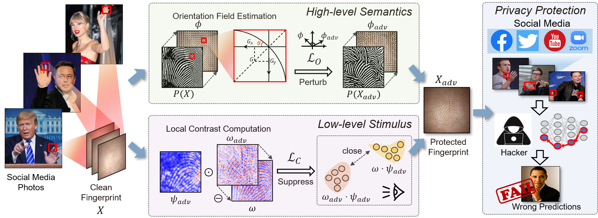

# FingerSafe

This is the official code to reproduce the result in FingerSafe (Hierarchical Perceptual Noise Injection for Social Media Fingerprint Privacy Protection).

#### Framework

## Prerequisites
(1) Request dataset here http://www4.comp.polyu.edu.hk/~csajaykr/fingerprint.htm (We are not able to share it here because of license requirement)
(2) Color the image using this paper: Gray2colornet: Transfer more colors from reference image
(3) Put the data in ./datasets
(4) Train a fingerprint recognition model using `identification.py` or `verification.py`, put the trained model in ./best_models

## How to run this code
### train a model
Make sure the dataset is organized as: 4 train images in 'train' subfolder, 2 test images in 'test' subfolders; each class have a folder with two subfolders as mentioned.
python runfile.py --adv="fingersafe" --train_path="./datasets/final/perturb_fingersafe_split" --test_pkl="./datapaths/datapath_valid_fingersafe_test.pkl" --batch_size=4 --epochs=30

### add adversarial attacks
Make sure the dataset is organized as: each class have a folder with 6 images.
testing stage：
（digital world）
-- input: "./datasets/final/veri_test"，the organization is 68 classes * 6 images per class(classes f269-f336)
-- output: "./datasets/final/veri_sample_XXX"，the organization is 68 classes * 6 images per class(classes f269-f336)
（physical world）
-- input: "./datasets/physical_square/evaluation"，the organization is 20 classes * 10 images per class(classes s1-f7~s1-f10，s2-f8~s2-f10，s3-f8~s3-f10，s4-f6~s4-f10，s5-f6~s5-f10)
-- output: "./datasets/physical_square/sample_XXX"，the organization is 20 classes * 10 images per class(classes s1-f7~s1-f10，s2-f8~s2-f10，s3-f8~s3-f10，s4-f6~s4-f10，s5-f6~s5-f10)

training stage：
（digital world）
-- input: "./datasets/final/train"，the organization is 268 classes * 6 images per class(classes f1-f268)
-- output: "./datasets/final/perturb_XXX"，the organization is 268 classes * 6 images per class(classes f1-f268)
（physical world）
-- input: "./datasets/physical_square/database"，the organization is 30 classes * 10 images
-- output: "./datasets/physical_square/perturb_XXX"，the organization is 30 classes * 10 images

(1) Inject FingerSafe Noise on fingers, digital world version
python InjectNoise.py --dataroot="./datasets/final/veri_test" --batch_size=6

(2) Inject FingerSafe Noise on fingers, physical world version
According to the instructions in InjectNoise.py line82, line127, change the code and run:
python InjectNoise.py --dataroot="./datasets/physical_square/evaluation" --mask="./datasets/physical_square/masks/evaluation"

(3) Inject Lowkey Noise on fingers
python InjectNoise.py --dataroot="./datasets/final/veri_test" --batch_size=6 --method=LowKey

(4) Inject Malhotra Noise on fingers
python workshop.py --dataroot="./datasets/final/veri_test"

(5) Inject PGD Noise on fingers
python baseline.py --dataroot="./datasets/final/veri_test" --batch_size=6

(6) Inject BoundaryAttack Noise on fingers
According to the instructions in baseline.py line58, line71, change the code and run:
python baseline.py --dataroot="./datasets/final/veri_test" --batch_size=6

(7) Inject Fawkes Noise on fingers
python protection.py

### Other operations
(1) Preprocessing new adversarial images（convert=1~3，for MHS，HG，Frangi，convert=4 for JPEG compression）
python process_dataset.py --original_path="./datasets/final/veri_sample_fingersafe" --new_path="./datasets/final/MHS/sample_fingersafe" --convert=1

(2) Generate the map that organize the paths to verify: 
If we have the new adversarial images in "./datasets/final/veri_sample_fingersafe", and we want to organize the paths of the images in "./datapaths/datapath_fingersafe_test.pkl":
python class2veri.py --original_path="./datasets/final/veri_sample_fingersafe" --new_path="./datasets/final/fingersafe_test" --convert=1
python pkl.py --original_pkl="./datapaths/datapath_pgd_test.pkl" --original_type="pgd" --new_pkl="./datapaths/datapath_fingersafe_test.pkl" --new_type="fingersafe"

(2) Before identify:
RGB with no preprocessing:
python process_dataset.py --original_path="./datasets/final/veri_sample_fingersafe" --new_path="./datasets/final_identification/iden_fingersafe" --convert=5
Grey images with preprocessing:
python process_dataset.py --original_path="./datasets/final/MHS/sample_fingersafe" --new_path="./datasets/final_identification/iden_fingersafe" --convert=6 --pre="2015"

(3) Preparing data for training stage:
If we have the new adversarial images for training stage in "./datasets/final/perturb_fingersafe":
python process_dataset.py --original_path="./datasets/final/perturb_fingersafe" --new_path="./datasets/final/perturb_fingersafe_split" --convert=7
python class2veri.py --original_path="./datasets/final/perturb_fingersafe_split" --new_path="./datasets/final/valid_fingersafe_test" --convert=2
python pkl.py --original_pkl="./datapaths/datapath_valid_pgd_test.pkl" --original_type="pgd" --new_pkl="./datapaths/datapath_valid_fingersafe_test.pkl" --new_type="fingersafe"

### Testing
(1) verification
-- input: ./datapaths/XXX.pkl
-- output: ACC, TPR

a. RGB input:
python verification.py --weight="./best_models/clean_split_1009.pth" --root_clean="./datapaths/datapath_clean_test.pkl" --root_adv="./datapaths/datapath_fingersafe_test.pkl"

b. Grey images input (after preprocessing)：
Change ./models/inception_resnet_v1.py line336, nn.Conv2d(3, 64, kernel_size=(7, 7),...) --> nn.Conv2d(1, 64, kernel_size=(7, 7),...)(Single channel for each image)：
python verification.py --weight="./best_models/MHS_clean_best_1030.pth" --root_clean="./datapaths/datapath_MHS_clean_test.pkl" --root_adv="./datapaths/datapath_MHS_fingersafe_test.pkl"
python verification.py --weight="./best_models/HG_clean_best.pth" --root_clean="./datapaths/datapath_HG_clean_test.pkl" --root_adv="./datapaths/datapath_HG_fingersafe_test.pkl"
python verification.py --weight="./best_models/Frangi_clean_best.pth" --root_clean="./datapaths/datapath_Frangi_clean_test.pkl" --root_adv="./datapaths/datapath_Frangi_fingersafe_test.pkl"

c. Different backbones：
If we evaluate the TPR on ScatNet, DenseNet, InceptionV3:
python verification.py --weight="./best_models/densenet_clean_best.pth" --root_clean="./datapaths/datapath_clean_test.pkl" --root_adv="./datapaths/datapath_fingersafe_test.pkl" --backbone DenseNet
python verification.py --weight="./best_models/inception_clean_best.pth" --root_clean="./datapaths/datapath_clean_test.pkl" --root_adv="./datapaths/datapath_fingersafe_test.pkl" --backbone InceptionV3
python verification.py --root_clean="./datapaths/datapath_MHS_clean_test.pkl" --root_adv="./datapaths/datapath_MHS_fingersafe_test.pkl" --backbone ScatNet
If we use ScatNet, change Line 53, 211 in data.py, 224-->50

d. Non-learning method:
python traditional.py --method fingersafe

(2) identification
-- input: ./datasets/final_identification/iden_XXX，testing stage, organized as 68 classes * (4train/2test)
-- output: ACC

a. RGB input：
python identification.py --weight="./best_models/clean_split_1009.pth" --root_adv="./datasets/final_identification/iden_fingersafe" --database="training" --query="testing"

b. Grey images input (after preprocessing)：
Change ./models/inception_resnet_v1.py line336, nn.Conv2d(3, 64, kernel_size=(7, 7),...) --> nn.Conv2d(1, 64, kernel_size=(7, 7),...)(Single channel for each image)：
python identification.py --weight="./best_models/MHS_clean_best_1030.pth" --root_adv="./datasets/final_identification/iden_fingersafe" --database="2015_train" --query="2015_test"
python identification.py --weight="./best_models/HG_clean_best.pth" --root_adv="./datasets/final_identification/iden_fingersafe" --database="2017_train" --query="2017_test"
python identification.py --weight="./best_models/Frangi_clean_best.pth" --root_adv="./datasets/final_identification/iden_fingersafe" --database="frangi_train" --query="frangi_test"

c. Different backbones：
If we evaluate the TPR on ScatNet, DenseNet, InceptionV3:
python identification.py --weight="./best_models/densenet_clean_best.pth" --root_adv="./datasets/final_identification/iden_fingersafe" --database="training" --query="testing" --backbone=DenseNet
python identification.py --weight="./best_models/inception_clean_best.pth" --root_adv="./datasets/final_identification/iden_fingersafe" --database="training" --query="testing" --backbone=InceptionV3
python identification.py --root_adv="./datasets/final_identification/iden_fingersafe" --database="2015_train" --query="2015_test" --backbone ScatNet

d. Traditional method:
Change line 466 in traditional.py:
python traditional.py --method fingersafe

## Functions for each code
-- back_to_raw.py: Used in real-world social media experiment. Put the protected fingerprint in right position in raw image.
-- cal_contrast.py: calculate L_C in FingerSafe.
-- convolutions.py: stolen from github to realize convolutions with padding=same.
-- criterion.py: evaluate and calculate TPR.
-- data.py: Sample positive and negative data pairs for verfication.
-- FingerprintDataset.py: Dataloader for FingerSafe.
-- FingerSafe.py: generate protection for FingerSafe.
-- Frangi_filter.py: preprocessing fingerprint using frangi filter.
-- identification.py: run fingerprint identification.
-- InjectNoise.py: Main entrance for generating adversarial examples using FingerSafe.
-- L_orinentation.py: Calculate L_O in FingerSafe.
-- process_dataset.py: preprocess the whole dataset using different preprocessing and split train/test dataset.
-- runfile.py: Train a neural network to recognize fingerprint in digital world.
-- segmentation.py: Used in real-world social media experiment. Get a segmented fingerprint from original image.
-- traditional.py: Used in non-learning method, recognize fingerprint by minutiae pairing.
-- verification.py: Used for verification.

## Video Demo
Also see our demo video, ./demo/FingerSafe.mp4 for FingerSafe protection!